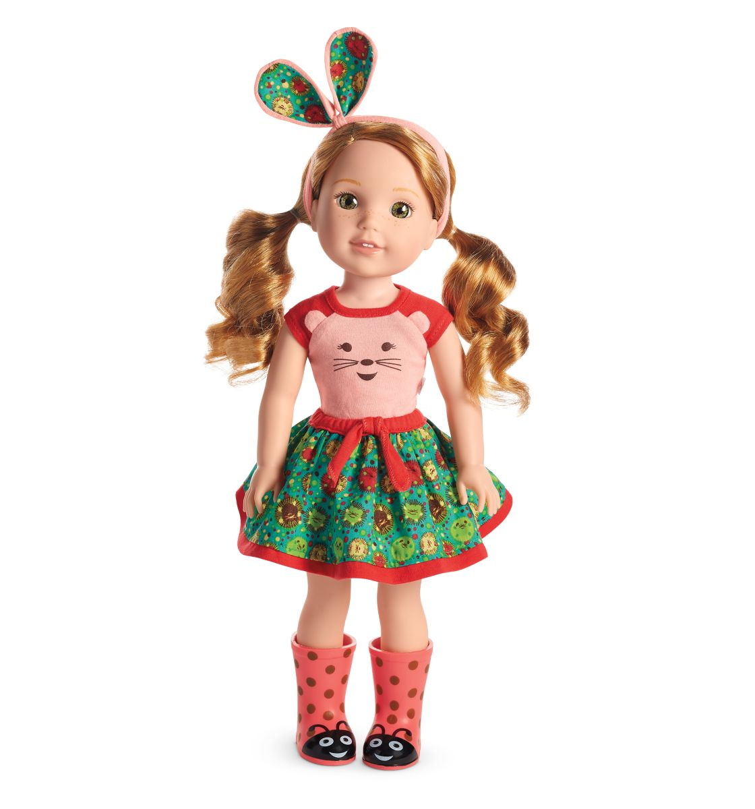

```{r setup, include=FALSE}
options(htmltools.dir.version = FALSE)
episode_counter <- 0
knitr::opts_chunk$set(
  collapse = TRUE,   
  comment = "#>"
)
```

```{r packages, include=FALSE}
library(countdown)
library(ymlthis)
library(tidyverse)
ggplot2::theme_set(ggplot2::theme_minimal())
```

```{r load-data, include=FALSE}
mockdata <- read_csv(here::here("static/mockpaper/data/mockboston.csv")) 
```


class: title-slide, center, middle

<span class="fa-stack fa-4x">
  <i class="fa fa-circle fa-stack-2x" style="color: #ffffffcc;"></i>
  <strong class="fa-stack-1x" style="color:#3b4245;">`r rmarkdown::metadata$session`</strong>
</span> 

# `r rmarkdown::metadata$title`

## `r rmarkdown::metadata$subtitle`

### `r rmarkdown::metadata$author` &#183; RStudio

#### [rmd4pharma.netlify.app/](https://rmd4pharma.netlify.app/)


---
class: middle, center

# <i class="fas fa-cloud"></i>

# Go here and log in (free):

<http://rstd.io/rmd4pharma-cloud>

---
class: middle, center

| Time          | Activity                                |
|:--------------|:----------------------------------------|
| 08:00 - 08:50 | Session 1 (R Markdown Anatomy)          |
| 08:50 - 09:00 | *Break* `r emo::ji("coffee")`           |
| 09:00 - 09:50 | Session 2 (Outputs & Tables)            |
| 09:50 - 10:00 | *Break* `r emo::ji("tea")`              |
| 10:00 - 10:50 | Session 3 (Graphics for Communication)  |
| 10:50 - 11:00 | *Break* `r emo::ji("potable_water")`    |
| 11:00 - 11:45 | Session 4 (Data & Workflows)            |
| 11:45 - 12:00 | Wrap-up / Overtime                      |

---
layout: true

<div class="my-footer"><span>https://rmd4pharma.netlify.app/</span></div>

---
background-image: url(images/hello.jpg)
background-position: top center
background-size: 100%
class: bottom, center

.pull-left[
### Alison Hill  
[<i class="fab fa-github"></i> @apreshill](https://github.com/apreshill)  
[<i class="fab fa-twitter"></i> @apreshill](https://twitter.com/apreshill)
]

.pull-right[
### Thomas Mock 
[<i class="fab fa-github"></i> @chendaniely](https://github.com/jthomasmock)  
[<i class="fab fa-twitter"></i> @chendaniely](https://twitter.com/thomas_mock)

]

.footnote[All content is CC-BY. All art (unless otherwise noted) is by [Desirée De Leon](https://desiree.rbind.io/), CC-BY-NC-ND.]

---
background-image: url(images/deardata.jpg)
background-size: 50%

.footnote[https://www.dear-data.com/]


---

```{r child="what-is-rmd.Rmd"}

```

---

.left-column[
<span class="fa-stack fa-4x">
  <i class="fa fa-circle fa-stack-2x" style="color: #2f5275;"></i>
  <strong class="fa-stack-1x" style="color: #fff;">?</strong>
</span> 
]

.right-column[

# What is R Markdown?

1. ["An authoring framework for data science."](https://rmarkdown.rstudio.com/lesson-1.html) (`r emo::ji("heavy_check_mark")`)

1. [A document format (`.Rmd`).](https://bookdown.org/yihui/rmarkdown/) (`r emo::ji("heavy_check_mark")`)

1. [An R package named `rmarkdown`.](https://rmarkdown.rstudio.com/docs/) (`r emo::ji("heavy_check_mark")`)

1. ["A file format for making dynamic documents with R."](https://rmarkdown.rstudio.com/articles_intro.html) (`r emo::ji("heavy_check_mark")`)

1. ["A tool for integrating text, code, and results."](https://r4ds.had.co.nz/communicate-intro.html) (`r emo::ji("heavy_check_mark")`)

1. ["A computational document."](http://radar.oreilly.com/2011/07/wolframs-computational-documen.html) (`r emo::ji("heavy_check_mark")`)

1. Wizardry. (`r emo::ji("wizard")`)

]

---
class: center
background-image: url(https://media.giphy.com/media/11fDMHAzihB8D6/source.gif)

# Reproducibility crisis? 

???

We are not here today to solve science or medicine's reproducibility crisis.

What I do think R Markdown can help you with today when you leave here is to tackle two other crises: one I think of as the confidence crisis...

---
class: center
background-image: url(https://media.giphy.com/media/OPZZ6KWJOZ3AA/source.gif)

# Confidence crisis

---
class: center
background-image: url(https://dickbrouwer.com/img/meeting_cheese.png)
background-size: contain

# `r emo::ji("cheese")` Cheese crisis `r emo::ji("cheese")`

.footnote[https://dickbrouwer.com/blog/a-guide-to-better-meetings/]

---
class: middle, center

# Change your mental model

.pull-left[

### Source &harr; output

```{r echo=FALSE, out.width="50%"}
knitr::include_graphics("images/word.png")
```

]

.pull-right[

### Source &rarr; output

```{r echo=FALSE, out.width="50%"}

```

]

---
class: middle, center

# Change your mental model

.pull-left[

### Source &harr; output

```{r echo=FALSE, out.width="50%"}
knitr::include_graphics("images/haba-elise.jpg")
```

]

.pull-right[

### Source &rarr; output

```{r echo=FALSE, out.width="50%"}

```

]

---
background-image: url(images/welliewishers/Slide1.png)
background-size: cover
class: top, center

.footnote[https://www.americangirl.com/shop/c/welliewishers]

---
background-image: url(images/welliewishers/Slide2.png)
background-size: cover
class: top, center

.footnote[https://www.americangirl.com/shop/c/welliewishers]

---
class: middle, inverse, center

# Same ~~doll~~ source

# Different occasions

---
class: middle, center

# `html_document`

```{r echo=FALSE, out.width="40%"}

```

---
class: your-turn

# Your turn

Find a partner and look at `01-explore.Rmd` together. 
Look at the source, then `r emo::ji("yarn")` **Knit** to HTML.

Try to identify these parts in the source and the output:

1. The **metadata**

1. The **text** 

1. The **code**

1. The **output**

**If this was easy**, try to find all code that produces a *plot*.

_psst...`01-explore-alison-params.Rmd` is also there..._

```{r echo = FALSE}
countdown(minutes = 5)
```

---
class: live-code

# Basic anatomy I

We look at the source anatomy for `01-explore.Rmd` together:

1. The **metadata**

1. The **text** 

1. The **code**
    
---
class: center, middle

```{r knit-html, echo=FALSE, out.width="50%"}
knitr::include_graphics("images/Knit-to-html.jpg")
```

---
class: center, middle

```{r do-live, echo=FALSE, out.width="50%"}
knitr::include_graphics("images/doc-live.jpg")
```

---
class: live-code

# Basic anatomy II

We look at the output anatomy for `01-explore.Rmd` together:

1. The **metadata**

1. The **text** 

1. The **code**

1. The **output**


---
background-image: url(images/rmarkdown_wizards.png)
background-size: contain

.footnote[Art by [Allison Horst](https://twitter.com/allison_horst?lang=en)]

---
class: middle, center

# What is inside?


---
class: middle, center, inverse

<span class="fa-stack fa-4x">
  <i class="fa fa-circle fa-stack-2x" style="color: #fff;"></i>
  <strong class="fa-stack-1x" style="color:#2f5275;">`r (episode_counter <- episode_counter + 1)` </strong>
</span> 

--

# Metadata

---

# metadata: YAML

.pull-left[

_"YAML Ain't Markup Language"_


```yaml
---
key: value
---
```

]

.pull-right[

```{r echo=FALSE, out.width="75%", fig.align='center'}
knitr::include_graphics("images/orchestra.jpg")
```

]

---
class: middle, center

# Output options

---

# Save output options in your YAML

.pull-left[

```{r echo = FALSE}
yml_empty() %>% 
  yml_output(html_document()) %>% 
  asis_yaml_output()
```

```{r echo = FALSE}
yml_empty() %>% 
  yml_output(html_document(toc = TRUE)) %>% 
  asis_yaml_output()
```


]

.pull-right[

```{r echo=FALSE, out.width="75%", fig.align='center'}
knitr::include_graphics("images/orchestra.jpg")
```

]

---
class: your-turn

# Your turn

## Edit your YAML

Use `?html_document` from your R console to:

1. Add a floating table of contents

1. Add a theme

1. Use the "kable" method to print data frames (more on this later!) 

`r emo::ji("yarn")` **Knit** to HTML to see the output.

**If this was easy**, try to embed the `Rmd` source code to download.

_psst...answers on the next slide..._

```{r echo = FALSE}
countdown(minutes = 3)
```

---
class: your-turn

# Answers

```{r echo = FALSE}
yml_empty() %>% 
  yml_output(html_document(toc = TRUE,
                           toc_float = TRUE,
                           theme = "flatly",
                           df_print = "kable",
                           code_download = TRUE)) %>% 
  asis_yaml_output()
```

---
class: inverse, center, middle

<span class="fa-stack fa-4x">
  <i class="fa fa-circle fa-stack-2x" style="color: #fff;"></i>
  <strong class="fa-stack-1x" style="color:#2f5275;">`r (episode_counter <- episode_counter + 1)` </strong>
</span> 

--

# Text

---

# <center>Headers</center>

--

.pull-left[
```markdown
# HEADER 1

## HEADER 2

### HEADER 3

#### HEADER 4

##### HEADER 5

###### HEADER 6
```
]

--

.pull-right[
# HEADER 1

## HEADER 2

### HEADER 3

#### HEADER 4

##### HEADER 5

###### HEADER 6
]

---


---

# <center>Text</center>

--

.pull-left[
```markdown
Childhood **vaccines**  
are one of the  
_great triumphs_  
of modern medicine. 
```
]

--

.pull-right[

Childhood **vaccines**  
are one of the  
_great triumphs_  
of modern medicine. 

]

---
class: top

# <center>Lists</center>

--

.pull-left[

```markdown
Indeed, parents whose children are  
vaccinated no longer have to worry about  
their child's death or disability from:

- whooping cough, 
- polio, 
- diphtheria, 
- hepatitis, or 
- a host of other infections.

Vaccines are the most cost-effective health  
care interventions there are. We have   
three new, extremely effective vaccines to  
roll out in developing countries:  

1. pneumonia
1. rotavirus
1. meningitis A
```

]

--

.pull-right[

Indeed, parents whose children are  
vaccinated no longer have to worry about  
their child's death or disability from:

- whooping cough, 
- polio, 
- diphtheria, 
- hepatitis, or 
- a host of other infections.

Vaccines are the most cost-effective health  
care interventions there are. We have  
three new, extremely effective vaccines to  
roll out in developing countries:

1. pneumonia
1. rotavirus
1. meningitis A

]

---

# <center>Images</center>

--

.pull-left[
```markdown
Receiving rubella vaccination, Brazil, 2008.

```
]

--

.pull-right[
Receiving rubella vaccination, Brazil, 2008.

]

---

# <center>Links</center>

--

.pull-left[
```markdown
[Photo](https://en.wikipedia.org/wiki/Vaccine)

Receiving rubella vaccination, Brazil, 2008.

```
]

--

.pull-right[
[Photo](https://en.wikipedia.org/wiki/Vaccine)

Receiving rubella vaccination, Brazil, 2008.

]

---
name: 03-formative
class: middle

# Pop quiz

--

.pull-left[

How do you add headers in Markdown?

`! Header`

`- Header`

`# Header`

`1. Header`

]

--

.pull-right[

What about lists? Bulleted? Numbered?

`! Item 1`

`- Item 1`

`# Item 1`

`1. Item 1`

]

---
class: inverse, center, middle

<span class="fa-stack fa-4x">
  <i class="fa fa-circle fa-stack-2x" style="color: #fff;"></i>
  <strong class="fa-stack-1x" style="color:#2f5275;">`r (episode_counter <- episode_counter + 1)` </strong>
</span> 

--

# <i class="fab fa-r-project"></i> code

---

# Code chunks

.pull-left[

````
```{r}`r ''`
mockdata %>% 
  distinct(arm)
```
````

What is the fate of this chunk?

]

--

.pull-right[

```{r}
mockdata %>% 
  distinct(arm)
```

]

---

# Code chunks

.pull-left[

````
```{r}`r ''`
n_sites <- n_distinct(mockdata$site)
```
````

What fate do you predict here?

]

--

.pull-right[

```{r}
n_sites <- n_distinct(mockdata$site)
```

  
]

---

# Code chunks

.pull-left[

````
```{r}`r ''`
n_sites <- n_distinct(mockdata$site)
n_sites
```
````

]

--

.pull-right[

```{r}
n_sites <- n_distinct(mockdata$site)
n_sites
```

  
]

---

# Code chunks

.pull-left[

````
```{r}`r ''`
ggplot(mockdata, aes(x = arm, 
                     y = n, 
                     fill = arm)) +
  geom_col()
```
````

What about this one?

]

--

.pull-right[

```{r fig.retina=3, out.width="70%", fig.align='center'}
ggplot(mockdata, aes(x = arm, 
                     y = n, 
                     fill = arm)) +
  geom_col()
```

]

---

# Add chunks

button or

Command (or Cmd) `⌘` + Option (or Alt) `⌥` +  `i` (Mac)

Ctrl + Alt + `i` (Windows/Linux)

---

# Run chunks

.pull-left[
interactively (show button)
]

.pull-right[
whole doc (knit button or run all chunks or )
]

---
class: inverse, center, middle

<span class="fa-stack fa-4x">
  <i class="fa fa-circle fa-stack-2x" style="color: #fff;"></i>
  <strong class="fa-stack-1x" style="color:#2f5275;">`r (episode_counter <- episode_counter + 1)` </strong>
</span> 

--

# Output

---

# Chunk options

.pull-left[

````
```{r}`r ''`
glimpse(mockdata)
```
````

]

.pull-right[

```{r}
glimpse(mockdata)
```

]

---

# echo

.pull-left[

````
```{r echo=FALSE}`r ''`
glimpse(mockdata)
```
````

]

.pull-right[

```{r echo=FALSE}
glimpse(mockdata)
```

]

---

# eval

.pull-left[

````
```{r eval=FALSE}`r ''`
glimpse(mockdata)
```
````

]

.pull-right[

```{r eval=FALSE}
glimpse(mockdata)
```

]

---

# include

.pull-left[

````
```{r include=FALSE}`r ''`
glimpse(mockdata)
```
````

]

.pull-right[

```{r include=FALSE}
glimpse(mockdata)
```

]

---

# Chunk options

.pull-left[

````
```{r echo=TRUE, results='hide'}`r ''`
glimpse(mockdata)
```
````

]

.pull-right[

```{r echo=TRUE, results='hide'}
glimpse(mockdata)
```

]

+ Place between curly braces<br>`{r option=value}`

+ Multiple options separated by commas<br>`{r option1=value, option2=value}`

+ Careful! The `r` part is the **code engine** (other engines possible)

---

.left-column[
# Default options
]

.right-column[
```{r}
str(knitr::opts_chunk$get())
```

]

---

# Chunk labels

.pull-left[

````
```{r peek, echo=FALSE, results='hide'}`r ''`
glimpse(mockdata)
```
````

]

.pull-right[

+ Place between curly braces<br>`{r label}`

+ Separated options with commas<br>`{r label, option1=value}`

+ Careful! No duplicate chunk labels

    ````
    ```{r peek}`r ''`
    head(mockdata)
    ```
    ````

    ```
    Error in parse_block(g[-1], g[1], params.src) : 
      duplicate label 'peek'
    Calls: <Anonymous> ... process_file -> split_file -> lapply -> FUN -> parse_block
    Execution halted
    ```

]

???

how can we make it easier on ourselves to explore the code in here?

show how to add chunk labels and view in IDE interactively

---
class: middle, center

# Pet or livestock?

.footnote[https://masalmon.eu/2017/08/08/chunkpets/]

---
class: middle, center

# A good chunk label

.pull-left[

### Good

`myplot`

`my-plot`

`myPlot`

`myplot1`

]

.pull-right[

### Bad

`my_plot`

`my plot`

everything else!

]

---

# The setup chunk


.pull-left[

````
```{r setup, include=FALSE}`r ''`
knitr::opts_chunk$set(
  collapse = TRUE,   
  comment = "#>", 
  out.width = "100%" 
)
```
````

]

.pull-right[

+ A special chunk label: `setup`

+ Typically the first chunk

+ All following chunks will use these options (i.e., sets global chunk options)

+ **Tip**: set `include=FALSE`

+ You can (and should) use individual chunk options too

]

---
class: your-turn

# Your turn

## New data dump! `r emo::ji("newspaper")`

Data from more sites just came in &mdash; we now have data for Boston, Seattle, and Denver.

1. Replace `mockboston` in the file `mockbsd`. 

1. `r emo::ji("yarn")` **Knit** to HTML. Do you see data for all 3 sites?

1. Clean up the chunks (split, combine, label, use options as you see fit)

1. Use the RStudio outline pane; rejoice!

**If this was easy**, try to use a parameter for the data file.

_psst...`01-explore-alison-params.Rmd` is still there..._


```{r echo = FALSE}
countdown(minutes = 5)
```

---
class: middle, center

# Take-aways

--

`r emo::ji("heavy_check_mark")` **Document your document:** use YAML to set up meaningful metadata

--

`r emo::ji("heavy_check_mark")` **Style your document:** use YAML to add options to your chosen output format

--

`r emo::ji("heavy_check_mark")` **Organize your text:** use markdown headers with `#`

--

`r emo::ji("heavy_check_mark")` **Organize your code:** use `knitr` chunk labels

--

`r emo::ji("heavy_check_mark")` **Style your text:** use markdown **bold**, _italics_, <i class="fas fa-list-ul"></i> bullets, and <i class="fas fa-list-ol"></i> lists

--

`r emo::ji("heavy_check_mark")` **Style your output:** use `knitr` chunk options

--

`r emo::ji("yarn")` early, `r emo::ji("yarn")` often


---
class: middle, center

# `r emo::ji("stopwatch")`

# Time for a break!

```{r echo = FALSE}
countdown(minutes = 10, update_every = 15)
```


