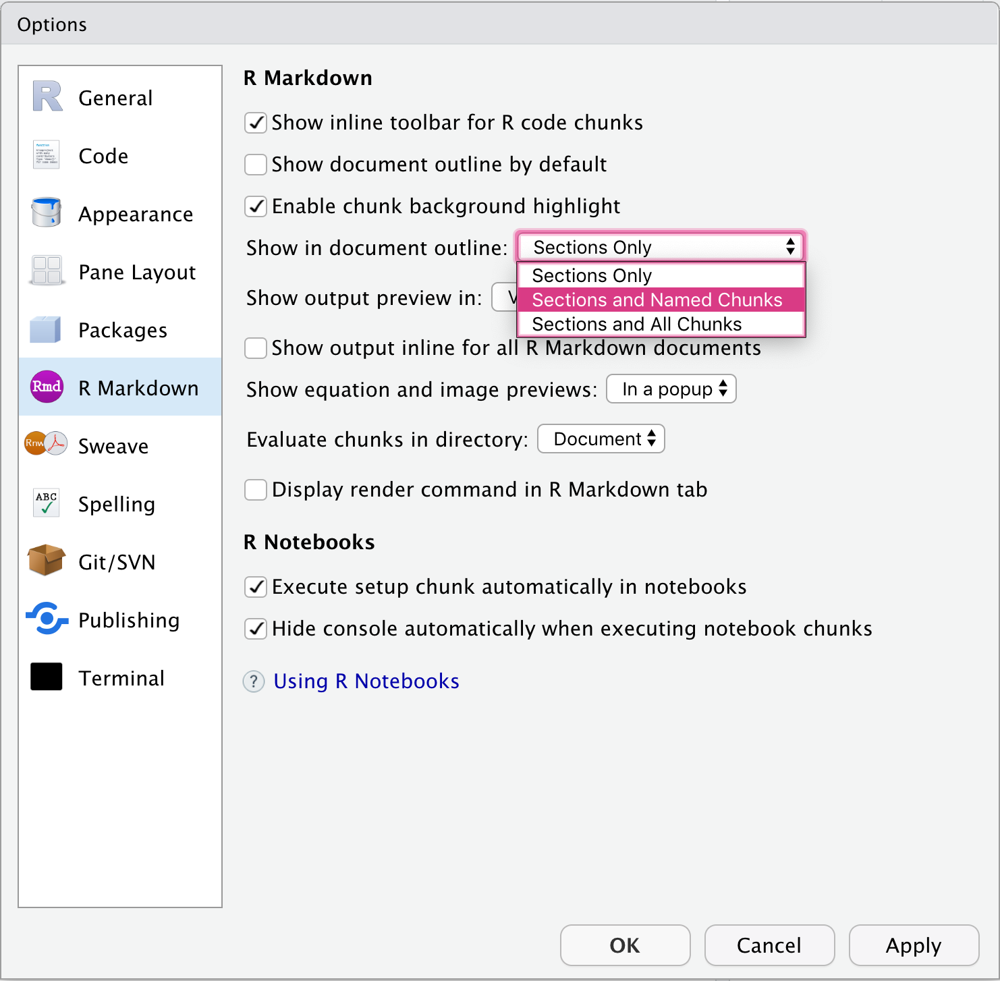

# (PART) R Markdown Basics {-}

```{r include = FALSE}
library(tidyverse)
library(ymlthis)
```


# Introduction {-}

Check out `first-look.Rmd`.

## Formative assessments

1. Identify the basic anatomy of an R Markdown document. 
    + Which part is the YAML?
    + Which part(s) are text written in Markdown?
    + Which part(s) are R code?

1. Knit an R Markdown document to HTML.
    + Which part(s) are output? (answer: all plots, printed output)
    + How can we control what the code and/or output look like?

1. Add headers in an R Markdown document to improve organization and usability of your text.
    + How do we add headers in Markdown? (answer: `#` symbols, up to 6)
    + What features of the IDE can you leverage when you do that?
    
1. Add names to code chunks to improve organization and usability of your R code.
    + How do we add chunk names? (answer: `knitr`)
    + What features of the IDE can you leverage when you do that?
    
1. Change output options for a given output format.
    + How do we change output options? (answer: YAML)
    + How do we add an output option like toc to the HTML format?

# Basic Anatomy

A plain text file with a special file extension: .Rmd

What does plain text mean? Everything you see can be typed with a normal keyboard. This means anyone can read and edit a .Rmd file.

What does the file extension do?

Aim to build up vocabulary and intuition around (use default output format here, HTML, and knit with button; consider providing a template to use here and publish to RSConnect quick; highlight how chunk naming works like setup chunk and browsability within IDE [ i.e., table of contents on right] plus how fig.path works): 

+ metadata (= YAML), → either rmarkdown (for params) or pandoc
+ text (= Markdown), [but inline code is processed by rmarkdown `r`]
+ R code (= knitr), [other code too! Today we use for R, but I do want you to know...]
+ Output (control with knitr code chunk options).

Formative assessments focus on "if I want to change X, what do I search for?"
Activity: Open a new Rmd file- read through it- knit it. → for each activity, do it first (model), then they do (build up muscle memory for knitting bc they’ll have done it like 50 times throughout workshop)

start with prewritten script and work from there- fill in....

nice warmup activity- get in groups, introduce, work through script, what does it do? Annotate, narrate.


# Using R Markdown in RStudio

+ Projects
+ Knit button

# Whole document metadata

You are probably not used to thinking about medical manuscripts as having "metadata", but all files have metadata. Some is set for you automatically by your software (right-click on a file on your computer and select "Get Info" to see some). Others you may set yourself, like in a document's filename; think: `asd_obesity_2015.Rmd`. Other metadata may be present in your directory structure, like:

```bash
Documents/
└── manuscripts/
     ├── autism-treatment-network/
     │    ├── asd_aggression_2014.Rmd
     │    ├── asd_obesity_2015.Rmd
     │    └── asd_mullen_2019.Rmd
```


So the file `asd_obesity_2015.Rmd` was my analysis of data from the Autism Treatment Network for a manuscript on obesity we published in 2015. 

When you start working in R Markdown, we try to store metadata *inside* the document itself. The place to store it is in what is called the YAML header (sometimes called YAML frontmatter), which is the space at the top of your .Rmd that is fenced in by three dashes as delimiters (`---`) like this:

```{r echo = FALSE}
dinky_yml <- yml(date = FALSE, author = FALSE) %>% 
  yml_title("A compelling manuscript") %>% 
  yml_author("Alison Hill") %>% 
  yml_output(html_document())
dinky_yml %>% 
  asis_yaml_output()
```

What kinds of metadata are useful for medical manuscripts? Think about things you may often add to the header of a Word document you plan to share with other people like collaborators: 

+ the **author**
+ the **date** the document was written (or last updated!)
+ a **title** (perhaps with a **subtitle**) to frame what the document is all about for the reader

All of these things are "keys" we can add to an `.Rmd` document using the YAML header.


## All about YAML

YAML stands for "YAML Ain't No Markup Language", and you are not the only one to read that and think "well, that is not very helpful at all." The most important things to know about YAML are that:

1. You can only have one YAML per .Rmd document (meaning, there is only one source of metadata for the file, which makes sense!).

1. The contents of a YAML are formatted as a series of `key: value` pairs separated by colons; each key on a new line. In the YAML above, the keys are `r knitr::combine_words(names(dinky_yml))`.

1. Indentation matters.  
&nbsp;&nbsp;&nbsp;Indentation matters.   
&nbsp;&nbsp;&nbsp;&nbsp;&nbsp;Indentation matters.

:::tip
You can "reuse" the content in your YAML in your text too. For example, using R code, `rmarkdown::metadata$title` will print:

`r rmarkdown::metadata$title` 

...in this text, because it is pulling metadata from our book's `title` set in the YAML.
:::

## Changing output formats


Let's focus first on the most important key in our YAML above: the output format. R Markdown comes with a suite of possible ["output formats"](https://rmarkdown.rstudio.com/docs/reference/index.html#section-output-formats) built-in.


:::turn
<h3>Your turn</h3> <br>
Change this document's output format from `html_document` to `word_document`.<br>
Save and `r emo::ji("yarn")` "Knit to Word"!
:::


## Adding output options

In YAML, indentation is used to indicate nesting. Why do you need to indent? Usually, you want to add output options for a given output format. Output options can be set in your YAML, but they must be *nested* under the output format. The spacing here is *critical* as you won't get an error message when you do it wrong- usually your document will "knit" but silently fail.

<div class = side-by-side>
<div class = side1>

On the right, I've added some [options](https://rmarkdown.rstudio.com/docs/reference/html_document.html) to the `html_document` format.

We can give the document a table of contents, and make it a *floating* table of contents, by setting both option arguments to `true` (the default is `false`). 

Try it out to see what this looks like.

</div>
<div class = side2>
```{r echo = FALSE}
dinky_yml %>% 
  yml_output(html_document(toc = TRUE, toc_float = TRUE)) %>% 
  asis_yaml_output()
```
</div>
</div>

:::turn
<h3>Your turn</h3> <br>
Word documents can have a table of contents too, but not a floating one. Try adding a `toc` to your word document output. Save and `r emo::ji("yarn")` "Knit to Word"!
:::

:::tip
You can see output options for each output format on the [R Markdown reference page](https://rmarkdown.rstudio.com/docs/reference/). For example, here are the [options](https://rmarkdown.rstudio.com/docs/reference/word_document.html) for word documents. When options are set in the YAML, replace `=` with `:` with each key-value pair on a new line.

Watch<br>
&nbsp;&nbsp;your<br>   
&nbsp;&nbsp;&nbsp;&nbsp;indentation.
:::


# Add text with Markdown

## Headers

Headers are useful for organizing your document into sections, and with Markdown formatting you can have up to 6 types/sizes of headers. Use a `#` symbol before the label to create a new header.


<div class = side-by-side>
<div class = side1>

```markdown
# HEADER 1

## HEADER 2

### HEADER 3

#### HEADER 4

##### HEADER 5

###### HEADER 6
```

</div>
<div class = side2>

<h1>Header 1</h1>
<h2>Header 2</h2>
<h3>Header 3</h3>
<h4>Header 4</h4>
<h5>Header 5</h5>
<h6>Header 6</h6>

</div>
</div>


The RStudio IDE has several features that are nice for R Markdown users. One is the drop-down
code navigator in the bottom-left of your file editor as shown in Figure \@ref(fig:md-nav) (from the [R for Data Science book](https://r4ds.had.co.nz/)).

```{r md-nav, echo=FALSE, fig.cap="RStudio code navigator", out.width="30%", fig.link='https://r4ds.had.co.nz/', fig.align="center"}
knitr::include_graphics("https://r4ds.had.co.nz/screenshots/rmarkdown-chunk-nav.png")
```

As you can see, this uses your Markdown headers to allow you to navigate around your `.Rmd` file. You can also use the RStudio outline pane, as shown in Figure \@ref(fig:md-outline) (from the [RStudio blog](https://rviews.rstudio.com/2016/11/11/easy-tricks-you-mightve-missed/)).

```{r md-outline, echo=FALSE, fig.cap="RStudio outline pane", out.width="80%", fig.link='https://rviews.rstudio.com/2016/11/11/easy-tricks-you-mightve-missed/', fig.align="center"}
knitr::include_graphics("https://www.rstudio.com/wp-content/uploads/2016/11/tip_outline.gif")
```


:::turn
<h3>Your turn</h3> <br>
Try using the RStudio code navigator or outline pane to see the outline for `first_look.Rmd` based on the Markdown headers. Use them to navigate to different sections in the document.
:::


## Text & Images

Let's take a lightly-edited snippet from a [blog post](https://www.huffpost.com/entry/post_b_755048) originally published on the Huffington Post in 2010, and show it in raw Markdown (L) and rendered (R).

<div class = side-by-side>
<div class = side1>

```markdown
# How We Can Save Over 4 Million Children

Childhood vaccines are one of the *great 
triumphs* of modern medicine. Indeed, 
parents whose children are vaccinated 
no longer have to worry about their child's 
death or disability from:

- whooping cough, 
- polio, 
- diphtheria, 
- hepatitis, or 
- a host of other infections. 

Vaccines are the **most cost-effective** 
health care interventions there are...
We have three new, extremely effective 
vaccines to roll out in developing countries:

1. pneumonia
1. rotavirus
1. meningitis A

By Ezekiel J. Emanuel, M.D., Ph.D.

[Photo:](https://en.wikipedia.org/wiki/Vaccine)

Receiving rubella vaccination, Brazil, 2008.

```

</div>

<div class = side2>

<h4>How We Can Save Over 4 Million Children</h4>

Childhood vaccines are one of the *great 
triumphs* of modern medicine. Indeed, 
parents whose children are vaccinated 
no longer have to worry about their child's 
death or disability from:

- whooping cough, 
- polio, 
- diphtheria, 
- hepatitis, or 
- a host of other infections. 

Vaccines are the **most cost-effective** 
health care interventions there are...
We have three new, extremely effective 
vaccines to roll out in developing countries:

1. pneumonia
1. rotavirus
1. meningitis A

By Ezekiel J. Emanuel, M.D., Ph.D.

[Photo:](https://en.wikipedia.org/wiki/Vaccine)

Receiving rubella vaccination, Brazil, 2008.

</div>
</div>

:::turn
<h3>Your turn</h3> <br>
Try using Markdown formatting to add some **bold** text or *italics*. <br>
If this is easy, try creating numbered and unnumbered lists, or adding links or images.
:::

# Add code

+ Evaluate code chunks
+ Add chunks (keyboard shortcut Ctrl + Alt + I (OS X: Cmd + Option + I))
+ Inline code
+ Why name chunks?

  

:::turn
<h3>Your turn</h3> <br>
Try updating your preferences for the [RStudio code outline pane](https://rviews.rstudio.com/2016/11/11/easy-tricks-you-mightve-missed/#code-outline) to include all or only named code chunks, if you like! You can also make the document outline show by default every time you open a file.
:::

# Use chunk options

+ play with include, echo (change the package loading chunk to include = TRUE)
+ use setup chunks to change all chunk options (fig.path!)


## How it all works

# Uplevel {#up-rmd}

## Adding output formats

<div class = side-by-side>
<div class = side1>

    
You *can* also have more than one output format! 

If no output options need to be specified, the output format needs to be suffixed by `default`.

</div>

<div class = side2>
    
```{r echo = FALSE, warning = FALSE}
dinky_yml %>% 
  yml_output(word_document(toc = TRUE),
             pdf_document()) %>% 
  asis_yaml_output()
```

</div>
</div>
    
    
:::turn
<h3>Your turn</h3> <br>
Try **adding** `html_document: default` as an **additional** output format.
:::

## Adding multiple YAML keys

*Sometimes* (but only *sometimes*), you may wish to have multiple items within a single YAML key. Let's take the `author` key for example, because you can have more than one author:

```{r echo = FALSE, warning = FALSE}
dinky_yml %>% 
  yml_output(html_document(toc = TRUE, toc_float = TRUE)) %>%
  yml_author(c("Alison Hill", "Peter Higgins")) %>% 
  asis_yaml_output()
```


:::turn
<h3>Your turn</h3> <br>
Try *adding* 
:::


## Live preview without reknitting

Install the `xaringan` package, which is for making slides using R Markdown. You *could* use it for this (I do!), but you can just install the package for a single useful Addin that will allow you to live preview any single R Markdown document with an HTML output format *as you edit and save the changes*.

```{r eval = FALSE}
install.packages("xaringan")
```

After installing the package, be sure to restart your R session.

Then use the Addings drop-down menu in RStudio to "turn on" **Infinite Moon Reader**. Test it out by opening up `first-look.Rmd` again, make a change to something, and click the save button in RStudio. Your live preview HTML output document should update immediately.


## Beef up your YAML

ymlthis!

What happens if you want to add two possible output formats? You use your YAML- check out what happens to your knit button when working in RStudio if you update your YAML to look like this:

```yaml
---
title: "Response and adverse events to chemotherapy: A mock study"
author: 
- "Alison Hill, Ph.D."
- "Peter Higgins, MD, Ph.D."
output: 
  rmarkdown::html_document: default
  distill::distill_article: default
---
```

TODO: show how to use ymlthis this add these output formats

## Knit with parameters

## Knit from the command line

Cover `render()` here, and how it can override your YAML

## Extend your R Markdown

There are multiple R Markdown "extension packages" which (once installed) give you even more output formats to choose from (like dashboards, slide presentations, books, and blogs). 

:::rstudio-tip
The book you are reading is written using the [**bookdown**](https://bookdown.org/yihui/bookdown/) package, with the `bookdown::gitbook` output format.
:::

Here are some packages you can experiment with to extend the output formats available to you for a single R Markdown document:

| Package                                                         | = R Markdown +                                                                                                    | New output format                                                                                                                     |
|:-----------------------------------------------------------------|:-------------------------------------------------------------------------------------------------------------------|:---------------------------------------------------------------------------------------------------------------------------------------|
| [`rmarkdown`](https://rmarkdown.rstudio.com/docs/)              | [Bootswatch CSS](https://bootswatch.com/)                                                                         | [`rmarkdown::html_document`](https://bookdown.org/yihui/rmarkdown/html-document.html)                                                 |
| [`flexdashboard`](https://rmarkdown.rstudio.com/flexdashboard/) | [flexbox CSS](https://developer.mozilla.org/en-US/docs/Web/CSS/CSS_Flexible_Box_Layout/Basic_Concepts_of_Flexbox) | [`flexdashboard::flex_dashboard`](https://bookdown.org/yihui/rmarkdown/dashboards.html)                                               |
| [`xaringan`](https://github.com/yihui/xaringan)                 | [remark.js](https://github.com/gnab/remark)                                                                       | [`xaringan::moon_reader`](https://bookdown.org/yihui/rmarkdown/xaringan.html)                                                         |
| [`distill`](https://rstudio.github.io/distill/)                 | [Distill CSS](https://distill.pub/guide/)                                                                         | [`distill::distill_article`](https://rstudio.github.io/distill/basics.html#creating-an-article)                                       |
| [`pagedown`](https://pagedown.rbind.io/)                        | [Paged.js](https://gitlab.pagedmedia.org/tools/pagedjs) /   [ReLaXedJS](https://github.com/RelaxedJS/ReLaXed)     | [`pagedown::html_paged`](https://pagedown.rbind.io/#pagedjs)   [`pagedown::html_resume`](https://pagedown.rbind.io/#resume)  + others |

## R Markdown templates

Use by adding to YAML *or* knitting at the command line (recommend focusing on beefing up your YAML).

+ [rticles](https://bookdown.org/yihui/rmarkdown/journals.html)
+ any package like `rmd4edu`
+ [tufte::tufte_html](https://rstudio.github.io/tufte/)
+ [distill::distill_article](https://rstudio.github.io/distill/)

If you want to add an additional output format *without* output options, then you need specify `: default`.

```yaml
output:
  distill::distill_article: 
    toc: true
  tufte::tufte_html: default
```

## GitHub {#git-rmd}
