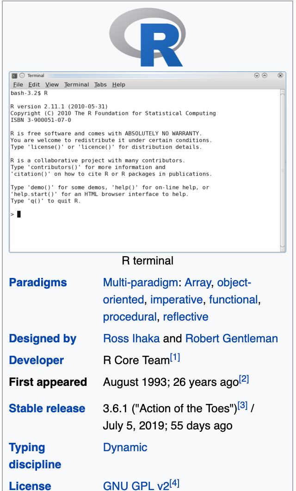
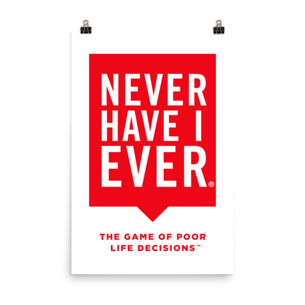
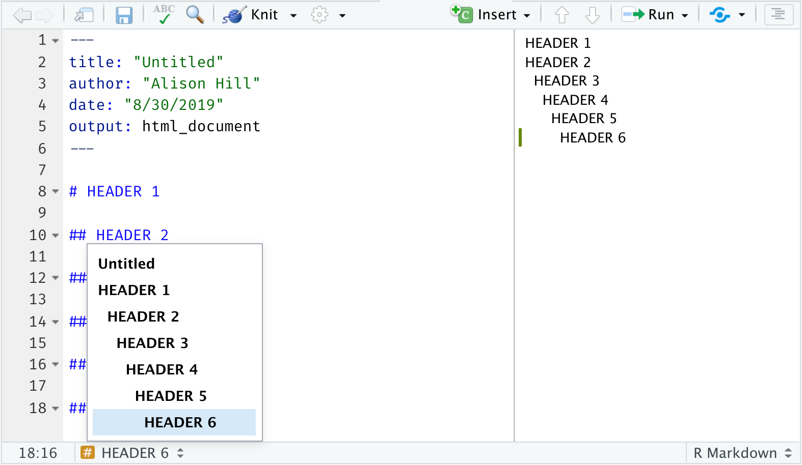

```{r setup, include=FALSE}
options(htmltools.dir.version = FALSE)
episode_counter <- 0
```

```{r packages, include=FALSE}
library(countdown)
```


class: title-slide, center, middle

<span class="fa-stack fa-4x">
  <i class="fa fa-circle fa-stack-2x" style="color: #ffffffcc;"></i>
  <strong class="fa-stack-1x" style="color:#3b4245;">`r rmarkdown::metadata$session`</strong>
</span> 

# `r rmarkdown::metadata$title`

## `r rmarkdown::metadata$subtitle`

### `r rmarkdown::metadata$author` &#183; RStudio

#### [rmd4medicine.netlify.com/](https://rmd4medicine.netlify.com/)


<!-- this ends up being the title slide since seal = FALSE-->

---
layout: true

<div class="my-footer"><span>rstudio.cloud/link</span></div>

<!-- this adds the link footer to all slides, depends on my-footer class in css-->

---

go here and log in (free):
cloud link

---
background-image: url(images/hello.jpg)
background-position: center center
background-size: 100%

cloud link
introduce self

---
class: middle, center

# Ph.D. student > Assistant Professor

.pull-left[
```{r echo = FALSE, out.width="50%"}
knitr::include_graphics("images/wiki-sas.png")
```
]

.pull-right[
```{r echo = FALSE, out.width="50%"}

```
]

---
class: middle, center

# Assistant > Associate Professor/PI

.pull-left[
```{r echo = FALSE, out.width="50%"}

```
]

.pull-right[
```{r echo = FALSE, out.width="50%"}
knitr::include_graphics("images/wiki-rstudio.png")
```
]

---
# Let's play a quick game

.pull-left[
### Never have I ever...

1. Copy/pasted figures into a paper

1. Had to re-run analyses because a data entry error was found

1. Had to redo anything in a paper to respond to a reviewer's question or suggestion

1. Had a shadow of doubt t

]

.pull-right[
```{r echo=FALSE, out.width="50%", fig.align="center"}

```

]


---

```{r child="what-is-rmd.Rmd"}

```

---

.left-column[
<span class="fa-stack fa-4x">
  <i class="fa fa-circle fa-stack-2x" style="color: #2f5275;"></i>
  <strong class="fa-stack-1x" style="color: #fff;">?</strong>
</span> 
]

.right-column[

# What is R Markdown?

1. ["An authoring framework for data science."](https://rmarkdown.rstudio.com/lesson-1.html) (`r emo::ji("heavy_check_mark")`)

1. [A document format (`.Rmd`).](https://bookdown.org/yihui/rmarkdown/) (`r emo::ji("heavy_check_mark")`)

1. [An R package named `rmarkdown`.](https://rmarkdown.rstudio.com/docs/) (`r emo::ji("heavy_check_mark")`)

1. ["A file format for making dynamic documents with R."](https://rmarkdown.rstudio.com/articles_intro.html) (`r emo::ji("heavy_check_mark")`)

1. ["A tool for integrating text, code, and results."](https://r4ds.had.co.nz/communicate-intro.html) (`r emo::ji("heavy_check_mark")`)

1. ["A computational document."](http://radar.oreilly.com/2011/07/wolframs-computational-documen.html) (`r emo::ji("heavy_check_mark")`)

1. Wizardry. (`r emo::ji("wizard")`)

]


---

bit more on "why Rmd for medicine?"

Your current workflow may look like (no shame!):

Enter data into Excel file

HIPAA-compliant transfer of data :)

You do some wrangling in combo of Excel/SPSS/SAS

---
class: middle, center

# Change your mental model

.pull-left[

### Content = presentation

```{r echo=FALSE, out.width="50%"}
knitr::include_graphics("images/word.png")
```

]

.pull-right[

### Content &rarr; presentation

]

---
class: your-turn

# Your turn

## .Rmd anatomy

Find a partner, and take a look at this R Markdown document together. 


Try to identify these parts of the document:

1. The **metadata**

1. The **text** (not code)

1. The **code**

If this was easy, try to find all code that produces a **table**, then all code that produces a **plot**.


```{r echo = FALSE}
countdown(minutes = 5)
```


---
name: 01-formative

# Basic anatomy I

.pull-left[
show "raw" doc
]

.pull-right[

1. The **metadata**

1. The **text** 

1. The **code**

]
    
---
class: center, middle

# Now we knit

```{r knit-html, echo=FALSE, out.width="50%"}
knitr::include_graphics("images/Knit-to-html.jpg")
```


---
class: center, middle


---
name: 02-formative

# Basic anatomy II

.pull-left[
show output screenshot
]

.pull-right[

1. The **metadata**

1. The **text** 

1. The **code**

1. The **output**

]

---
background-image: url(images/rmarkdown_wizards.png)
background-size: cover

---
class: middle, center

# What is inside?


---
class: middle, center, inverse


<span class="fa-stack fa-4x">
  <i class="fa fa-circle fa-stack-2x" style="color: #fff;"></i>
  <strong class="fa-stack-1x" style="color:#2f5275;">`r (episode_counter <- episode_counter + 1)` </strong>
</span> 

--

# Metadata

--

Your document's control panel

---

# metadata: YAML

.pull-left[

_"YAML Ain't Markup Language"_

acronym not helpful, what does it mean, key: value pairs

think "metadata"

```{r echo = FALSE}
library(ymlthis)
yml_empty() %>% 
  yml_output(html_document()) %>% 
  asis_yaml_output()
```
]

.pull-right[
```{r echo=FALSE, out.width="75%", fig.align='center'}
knitr::include_graphics("images/orchestra.jpg")
```

]


---
class: middle, center

# Output options

--

The `output:` key in your YAML

--
nesting matters


---
class: your-turn

# Your turn

## Edit your YAML

.pull-left[

1. Add your name as first author

1. Change the title to something you might actually write

1. Add a floating table of contents

1. Add a theme ([pick one](https://bookdown.org/yihui/rmarkdown/html-document.html#appearance-and-style))

1. `r emo::ji("yarn")` **Knit** to HTML.

]

.pull-right[

```{r echo = FALSE}
library(ymlthis)
yml_empty() %>% 
  yml_author("Your name here") %>% 
  yml_title("Your title here") %>% 
  yml_output(html_document(toc = TRUE,
                           toc_float = TRUE,
                           theme = "flatly")) %>% 
  asis_yaml_output()
```

]

```{r echo = FALSE}
countdown(minutes = 4)
```


---
class: inverse, center, middle

<span class="fa-stack fa-4x">
  <i class="fa fa-circle fa-stack-2x" style="color: #fff;"></i>
  <strong class="fa-stack-1x" style="color:#2f5275;">`r (episode_counter <- episode_counter + 1)` </strong>
</span> 

--

# Text

--

What do you want/need to say?


---

# <center>Headers</center>

--

.pull-left[
```markdown
# HEADER 1

## HEADER 2

### HEADER 3

#### HEADER 4

##### HEADER 5

###### HEADER 6
```
]

--

.pull-right[
# HEADER 1

## HEADER 2

### HEADER 3

#### HEADER 4

##### HEADER 5

###### HEADER 6
]

---




---
# <center>Text</center>

--

.pull-left[
```markdown
Childhood **vaccines**  
are one of the  
_great triumphs_  
of modern medicine. 
```
]

--

.pull-right[

Childhood **vaccines**  
are one of the  
_great triumphs_  
of modern medicine. 

]


---
class: top

# <center>Lists</center>

--

.pull-left[
```markdown
Indeed, parents whose children are  
vaccinated no longer have to worry about  
their child's death or disability from:

- whooping cough, 
- polio, 
- diphtheria, 
- hepatitis, or 
- a host of other infections.

Vaccines are the most cost-effective health  
care interventions there are. We have   
three new, extremely effective vaccines to  
roll out in developing countries:  

1. pneumonia
1. rotavirus
1. meningitis A
```
]

--

.pull-right[

Indeed, parents whose children are  
vaccinated no longer have to worry about  
their child's death or disability from:

- whooping cough, 
- polio, 
- diphtheria, 
- hepatitis, or 
- a host of other infections.

Vaccines are the most cost-effective health  
care interventions there are. We have  
three new, extremely effective vaccines to  
roll out in developing countries:

1. pneumonia
1. rotavirus
1. meningitis A

]

---

# <center>Images</center>

--

.pull-left[
```markdown
Receiving rubella vaccination, Brazil, 2008.

```
]

--

.pull-right[
Receiving rubella vaccination, Brazil, 2008.

]

---

# <center>Links</center>

--

.pull-left[
```markdown
[Photo](https://en.wikipedia.org/wiki/Vaccine)

Receiving rubella vaccination, Brazil, 2008.

```
]

--

.pull-right[
[Photo](https://en.wikipedia.org/wiki/Vaccine)

Receiving rubella vaccination, Brazil, 2008.

]

---
name: 03-formative
class: middle

# Pop quiz

--

.pull-left[

How do you add headers in Markdown?

`! Header`

`- Header`

`# Header`

`1. Header`

]

--

.pull-right[


What about bulleted lists in Markdown? Numbered?

`! Item 1`

`- Item 1`

`# Item 1`

`1. Item 1`

]

---
class: your-turn

# Your turn

## Organize your text

1. Add headers as you see fit in our current document.

1. Test out using RStudio outline pane; rejoice!

1. `r emo::ji("yarn")` **Knit** to HTML.

```{r echo = FALSE}
countdown(minutes = 2)
```

---
class: inverse, center, middle

<span class="fa-stack fa-4x">
  <i class="fa fa-circle fa-stack-2x" style="color: #fff;"></i>
  <strong class="fa-stack-1x" style="color:#2f5275;">`r (episode_counter <- episode_counter + 1)` </strong>
</span> 

--

# <i class="fab fa-r-project"></i> `code`

--

But other languages available!

---

# Code chunks

.pull-left[

````
```{r}`r ''`
med <- rep("rmd", 4)
med
```
````

]

.pull-right[

```{r}
med <- rep("rmd", 4)
med
```

]

---

# Add chunks

button or

Command (or Cmd) `⌘` + Option (or Alt) `⌥` +  `i`

Ctrl + Alt + `i`

---
class: inverse, center, middle

<span class="fa-stack fa-4x">
  <i class="fa fa-circle fa-stack-2x" style="color: #fff;"></i>
  <strong class="fa-stack-1x" style="color:#2f5275;">`r (episode_counter <- episode_counter + 1)` </strong>
</span> 

--

# `code` output

--

<i class="fas fa-chart-bar"></i> + <i class="fas fa-table"></i>

---

# Chunk options


+ echo
+ eval
+ include
+ results
+ out.width (skip for when we get to figures)
+ fig.show (skip for when we get to figures)


---
class: your-turn

# Your turn

## Change chunk options

1. give some ideas here

1. `r emo::ji("yarn")` **Knit** to HTML.


```{r echo = FALSE}
countdown(minutes = 2)
```


---

# Chunk labels

how can we make it easier on ourselves to explore the code in here?

show how to add chunk labels and view in IDE interactively

---

# The setup chunk

Have one, make include false, global options

have another one for loading packages

.pull-left[

````
```{r setup, include=FALSE}`r ''`
knitr::opts_chunk$set(
  collapse = TRUE,   
  comment = "#>", 
  out.width = "100%" 
)
```
````

]

.pull-right[


]

---
class: your-turn

# Your turn

## New data dump! `r emo::ji("newspaper")`

1. Data from more sites just came in! Replace `mockboston` in the file `mockbsd`. How many sites do we have now?

1. Clean up the chunks (split, combine, label as you see fit)

1. Use the RStudio outline pane; rejoice!

1. `r emo::ji("yarn")` **Knit** to HTML.


```{r echo = FALSE}
countdown(minutes = 5)
```


---
name: 04-formative

When you change the code chunk names, what did *not* change?

1. YAML 
1. Markdown
1. R code 
1. R output
1. `knitr` code chunk options

(for answer reveal, maybe show empty "template")


---
anatomy pic

# How it all fits together

---

```{r child="how-rmd-works.Rmd"}

```

---
class: top

.left-column[
<span class="fa-stack fa-4x">
  <i class="fa fa-circle fa-stack-2x" style="color: #2f5275;"></i>
  <strong class="fa-stack-1x" style="color: #fff;">?</strong>
</span> 

]


.right-column[

# How *does* R Markdown work?

1. `r emo::ji("shrug")` (`r emo::ji("heavy_check_mark")`)

1. ["I press knit, a document appears, and I believe that anything happening in between could be actual magic."](https://twitter.com/allison_horst/status/1070323369600442368?s=20) (`r emo::ji("wizard")`)

1. `knitr` executes the code and converts `.Rmd` to `.md`; **Pandoc** renders the `.md` file to the output format you want. (`r emo::ji("heavy_check_mark")`)

]

---
class: middle, center

```{r echo = FALSE, out.width="25%", fig.align="center"}
knitr::include_graphics("https://raw.githubusercontent.com/rstudio/hex-stickers/master/PNG/rmarkdown.png")
```


> "In a nutshell, R Markdown stands on the shoulders of `knitr` and **Pandoc**.

--

> The former executes the computer code embedded in Markdown, and converts R Markdown to Markdown.

--

> The latter renders Markdown to the output format you want (such as PDF, HTML, Word, and so on)."

--

> &mdash; [R Markdown: The Definitive Guide](https://bookdown.org/yihui/rmarkdown/)

---
class: center, middle

# Foreshadowing


```{r echo=FALSE, out.width="40%"}
knitr::include_graphics("images/outputs.png")
```


---
class: middle, center

# Take-aways

--

`r emo::ji("heavy_check_mark")` **Document your document:** use YAML to set up meaningful metadata

--

`r emo::ji("heavy_check_mark")` **Style your document:** use YAML to add options to your chosen output format

--

`r emo::ji("heavy_check_mark")` **Organize your text:** use markdown headers with `#`

--

`r emo::ji("heavy_check_mark")` **Organize your code:** use `knitr` chunk labels

--

`r emo::ji("heavy_check_mark")` **Style your text:** use markdown **bold**, _italics_, <i class="fas fa-list-ul"></i> bullets, and <i class="fas fa-list-ol"></i> lists

--

`r emo::ji("heavy_check_mark")` **Style your output:** use `knitr` chunk options

--

`r emo::ji("yarn")` early, `r emo::ji("yarn")` often


---
class: middle, center

# `r emo::ji("stopwatch")`

# Time for a break!

```{r echo = FALSE}
countdown(minutes = 10, update_every = 15)
```


