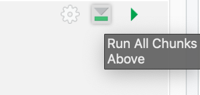
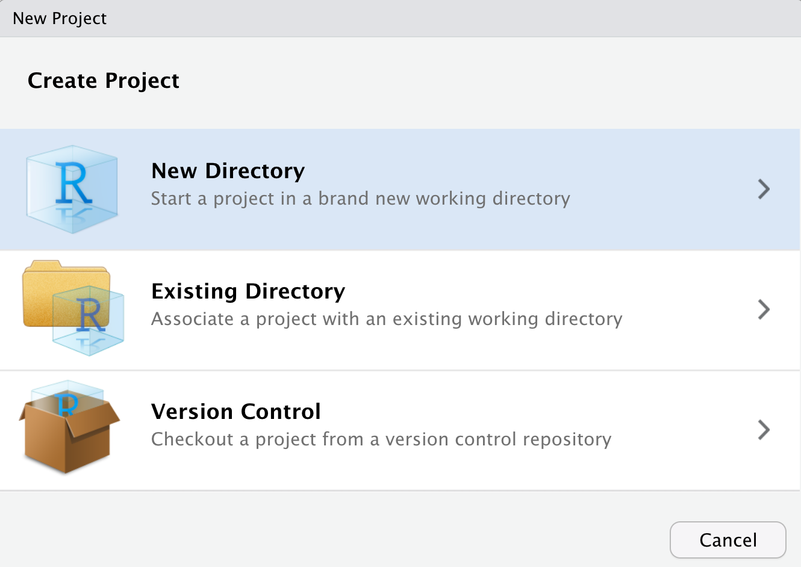
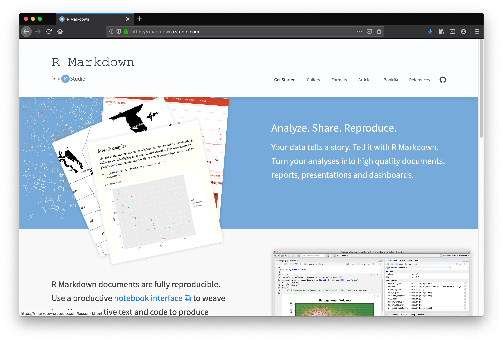
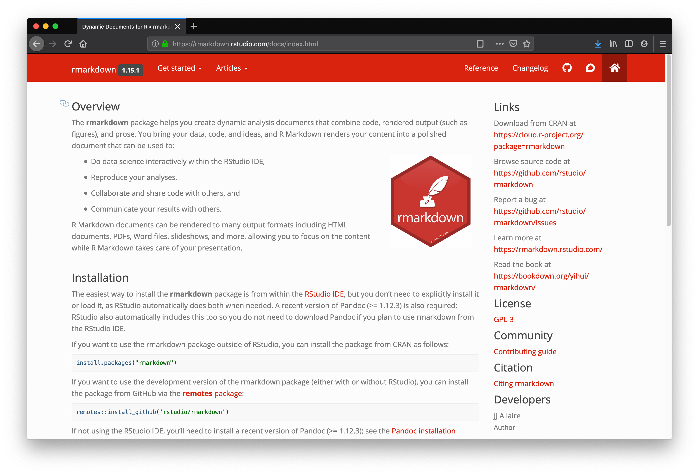

```{r setup, include=FALSE}
options(htmltools.dir.version = FALSE)
episode_counter <- 0
knitr::opts_chunk$set(
  collapse = TRUE,   
  comment = "#>"
)
options(knitr.table.format = "markdown")
```

```{r packages, include=FALSE}
library(countdown)
library(ymlthis)
```


class: title-slide, center, middle

<span class="fa-stack fa-4x">
  <i class="fa fa-circle fa-stack-2x" style="color: #ffffffcc;"></i>
  <strong class="fa-stack-1x" style="color:#3b4245;">`r rmarkdown::metadata$session`</strong>
</span> 

# `r rmarkdown::metadata$title`

## `r rmarkdown::metadata$subtitle`

### `r rmarkdown::metadata$author` &#183; RStudio

#### [rmd4medicine.netlify.com/](https://rmd4medicine.netlify.com/)

---
layout: true

<div class="my-footer"><span>https://rstd.io/rmd4medicine-cloud</span></div>

---

plot here times knitted so far

---

# Pop quiz: 

_(discuss with a neighbor)_

What are keys you'll typically want to use in the YAML?

1. The document `title`

1. The document `date`

1. The document `output` format

1. The document's `eval` option

1. The document's `author`

1. The document's `packages`

---
class: middle, center, inverse

<span class="fa-stack fa-4x">
  <i class="fa fa-circle fa-stack-2x" style="color: #fff;"></i>
  <strong class="fa-stack-1x" style="color:#2f5275;">`r (episode_counter <- episode_counter + 1)` </strong>
</span> 

--

# Hygiene


---
class: middle, center

# Philosophy

--

.pull-left[

### Less

# `r emo::ji("mouse")`
]

.pull-right[

### More

# `r emo::ji("musical_keyboard")`
]

---
class: middle, center


.pull-left[
```{r, echo = FALSE}
knitr::include_graphics("https://raw.githubusercontent.com/hadley/r4ds/master/screenshots/rstudio-workspace.png")
```
]

.pull-right[
# <i class="fas fa-mouse-pointer"></i>

In RStudio: _Tools > Global Options_

]

---
class: middle, center

# Restart R early & often

.pull-left[
# <i class="fas fa-mouse-pointer"></i>

In RStudio: _Session > Restart R_
]

.pull-right[
# <i class="far fa-keyboard"></i>

`Cmd/Ctrl` + `Shift` + `F10` (Mac)   
or  
`Ctrl` + `Shift` + `F10` (Windows/Linux)

]

---
class: middle, center

# Reknit up to...

.pull-left[
# <i class="fas fa-mouse-pointer"></i>



]

.pull-right[
# <i class="far fa-keyboard"></i>

Place cursor anywhere in your doc then:

`Command` + `Option` + `P` (Mac)  
or  
`Ctrl`+`Alt`+`P`  (Windows/Linux)
]


---
class: middle, center

# <i class="fas fa-smoking-ban"></i>

# Not recommended

```{r eval = FALSE}
rm(list = ls())
```

.footnote[https://whattheyforgot.org/save-source.html#rm-list-ls]

---
class: middle, center, inverse

<span class="fa-stack fa-4x">
  <i class="fa fa-circle fa-stack-2x" style="color: #fff;"></i>
  <strong class="fa-stack-1x" style="color:#2f5275;">`r (episode_counter <- episode_counter + 1)` </strong>
</span> 

--

# Projects


---
class: center, middle

# R projects

```{r echo=FALSE}
knitr::include_graphics("images/rproj.png")
```


---
class: middle, center

.pull-left[
# <i class="fas fa-mouse-pointer"></i>

_File > New Project..._
```{r, echo = FALSE}
knitr::include_graphics("images/rstudio-new.png")
```
]
--

.pull-right[
# <i class="fas fa-mouse-pointer"></i>

Pick one
```{r, echo = FALSE}

```
]

---
class: middle, center

.pull-left[
# <i class="fas fa-mouse-pointer"></i>

_File > New File > R Markdown..._
```{r, echo = FALSE}
knitr::include_graphics("images/rstudio-newfile.png")
```
]
--

.pull-right[
# <i class="fas fa-mouse-pointer"></i>

Fill in, can leave as HTML
```{r, echo = FALSE}
knitr::include_graphics("images/rstudio-newrmd.png")
```
]

---
class: middle, center

.pull-left[
# <i class="fas fa-trash-alt"></i>


]

--

.pull-right[
# <i class="fas fa-save"></i>


]

---

Whenever you refer to a file with a relative path it will look for it here.

- project organization 

- naming files


---
class: middle, center, inverse

<span class="fa-stack fa-4x">
  <i class="fa fa-circle fa-stack-2x" style="color: #fff;"></i>
  <strong class="fa-stack-1x" style="color:#2f5275;">`r (episode_counter <- episode_counter + 1)` </strong>
</span> 

--

# External files

---
class: center

```{r echo=FALSE}
knitr::include_graphics("images/Data.jpg")
```

save a local copy, keep raw data raw

---
class: middle

# File paths

.pull-left[

### <i class="far fa-thumbs-down"></i>

```{r eval=FALSE}
"~/mm/nope.csv"
setwd("/haha/good/luck/")
setwd('c:\iamyournightmare\!')
setwd("C:\user\oh\no")
setwd("path/that/only/works/on/my/machine")
```

### <i class="far fa-thumbs-up"></i>

```{r eval=FALSE}
mockdata <- read_csv(
  here::here("data/mockdata.csv")
  )
```

]

.pull-right[
```{r echo=FALSE, fig.align="center", fig.cap="Art by Allison Horst", out.width="90%"}
knitr::include_graphics("images/horst_here.png")
```
]

https://whattheyforgot.org/project-oriented-workflow.html#setwd


---

.footnote[https://whattheyforgot.org/safe-paths.html]


---

# Use `bookdown`

Try changing output format in your YAML to a bookdown one for single docs

.pull-left[

```{r echo = FALSE}
yml_empty() %>% 
  yml_output(html_document()) %>% 
  asis_yaml_output()
```

]

.pull-right[

```{r echo = FALSE}
yml_empty() %>% 
  yml_output(bookdown::html_document2()) %>% 
  asis_yaml_output()
```

]


---
class: middle, center, inverse

<span class="fa-stack fa-4x">
  <i class="fa fa-circle fa-stack-2x" style="color: #fff;"></i>
  <strong class="fa-stack-1x" style="color:#2f5275;">`r (episode_counter <- episode_counter + 1)` </strong>
</span> 

--

# Cross-references

---

# Header references


---

# Table references

---

# Add cross-references

To a section and a table in the text.

```{r echo = FALSE}
countdown(minutes = 5)
```

---
class: middle, center, inverse

<span class="fa-stack fa-4x">
  <i class="fa fa-circle fa-stack-2x" style="color: #fff;"></i>
  <strong class="fa-stack-1x" style="color:#2f5275;">`r (episode_counter <- episode_counter + 1)` </strong>
</span> 

--

# Bibliography

---


See [citations](http://rmarkdown.rstudio.com/authoring_bibliographies_and_citations.html#citations)

.pull-left[

    1. Blah blah [see @R-blogdown, pp. 33-35; also @R-knitr, ch. 1].

    2. Blah blah [@R-blogdown, pp. 33-35].

    3. Blah blah [@R-blogdown; @R-knitr].

    4. Yihui says blah [-@R-blogdown].

    5. @R-blogdown says blah.
]

.pull-right[
Generates these in-text citation styles:

1. Blah blah [see @R-blogdown, pp. 33-35; also @R-knitr, ch. 1].

2. Blah blah [@R-blogdown, pp. 33-35].

3. Blah blah [@R-blogdown; @R-knitr].

4. Yihui says blah [-@R-blogdown].

5. @R-blogdown says blah.

]

---
class: your-turn

# Your turn

### Choose your adventure

1. Take `04-manuscript.Rmd` and add in the tables and figures in code chunks, with code chunk options that make sense. `r emo::ji("yarn")` __Knit__ and/or run chunks interactively as you work.

1. Play with knitting to different output formats. Try to figure out valid output options for each format you can add to your YAML. 

1. Go to https://github.com/thomasp85/scico and try knitting with different palette names. Pick a favorite.

__Too much?__ Look at `04-manuscript-alison.Rmd`, `r emo::ji("yarn")` __Knit__. Then do 2 and 3 above.

__Not enough?__ See next slide for building a graphical user interface for parameters.

```{r echo=FALSE}
countdown(minutes = 15)
```

---
class: your-turn

# Your turn

### Extra: Play more with parameters

.pull-left[

From `03-draft.Rmd`

```{r echo = FALSE}
yml_empty() %>% 
  yml_params(palette = "berlin") %>% 
  asis_yaml_output()
```

]

.pull-right[

Try in `04-manuscript.Rmd`

```{r echo = FALSE}
yml_empty() %>% 
  yml_params(
    palette = shiny_select("scico palette:", 
                           choices = c("berlin", "roma", "cork", "grayC"), 
                           selected = "roma", 
                           multiple = FALSE)
  ) %>% 
  asis_yaml_output()
```
]

---

# If we have time...


.pull-left[

Open & Knit:

`analyis/presentations/slides.Rmd`

```{r echo=FALSE}
yml_empty() %>% 
  yml_output(beamer_presentation(slide_level = 2),
             powerpoint_presentation(),
             revealjs::revealjs_presentation()) %>% 
  asis_yaml_output()
```
]

.pull-right[

```{r echo = FALSE}
beamer_slides <-
  fs::dir_ls(path=here::here("static/slides/images"), 
           regexp="beamer*") %>%  
  purrr::map(magick::image_read) %>% 
  magick::image_join() %>% 
  magick::image_animate(fps = 1) 
beamer_slides
```


]


---
class: middle, center, inverse


# Time to wrap-up!

```{r echo = FALSE}
countdown(minutes = 15, update_every = 15)
```

---
class: middle, center, inverse

<span class="fa-stack fa-4x">
  <i class="fa fa-circle fa-stack-2x" style="color: #fff;"></i>
  <strong class="fa-stack-1x" style="color:#2f5275;">!</strong>
</span> 


# Extension formats

---
class: middle, center

# Dashboards

```{r echo = FALSE, out.width = "50%", fig.link="https://jenthompson.me/examples/progressdash.html"}
knitr::include_graphics("https://jenthompson.me/images/flexdash_example.png")
```

https://jenthompson.me/examples/progressdash.html

https://jenthompson.me/2018/02/09/flexdashboards-monitoring/

---
class: middle, center

# Presentations

```{r echo = FALSE, out.width="50%"}
beamer_slides
```

https://bookdown.org/yihui/rmarkdown/presentations.html

---
class: middle, center, inverse

<span class="fa-stack fa-4x">
  <i class="fa fa-circle fa-stack-2x" style="color: #fff;"></i>
  <strong class="fa-stack-1x" style="color:#2f5275;">!</strong>
</span> 


# Cheatsheets!

---
class: middle

.left-column[

# `r emo::ji("pushpin")`

]

.right-column[

_Help > Cheatsheets > RStudio IDE_

```{r echo = FALSE, out.width = "50%", fig.link="https://www.rstudio.com/resources/cheatsheets/#ide"}
knitr::include_graphics("https://442r58kc8ke1y38f62ssb208-wpengine.netdna-ssl.com/wp-content/uploads/2018/08/rstudio-ide.png")
```
]

.footnote[https://www.rstudio.com/resources/cheatsheets/#ide]

---
class: middle

.left-column[
# `r emo::ji("pushpin")`
]

.right-column[
_Help > Cheatsheets > R Markdown Cheat Sheet_

```{r echo = FALSE, out.width="50%", fig.link="https://www.rstudio.com/resources/cheatsheets/#rmarkdown"}
knitr::include_graphics("https://442r58kc8ke1y38f62ssb208-wpengine.netdna-ssl.com/wp-content/uploads/2018/08/rmarkdown-2.0.png")
```
]

.footnote[https://www.rstudio.com/resources/cheatsheets/#rmarkdown]

---
class: middle

.left-column[
# `r emo::ji("pushpin")`
]

.right-column[
_Help > Cheatsheets > R Markdown Reference Guide_

```{r echo = FALSE, out.width = "40%", fig.link="https://www.rstudio.com/wp-content/uploads/2015/03/rmarkdown-reference.pdf"}
knitr::include_graphics("https://442r58kc8ke1y38f62ssb208-wpengine.netdna-ssl.com/wp-content/uploads/2015/03/rmarkdown-reference-guide.png")
```

]

.footnote[https://www.rstudio.com/wp-content/uploads/2015/03/rmarkdown-reference.pdf]

---
class: middle, center, inverse

<span class="fa-stack fa-4x">
  <i class="fa fa-circle fa-stack-2x" style="color: #fff;"></i>
  <strong class="fa-stack-1x" style="color:#2f5275;">!</strong>
</span> 


# Book!

---
class: middle

.left-column[
# `r emo::ji("book")`
]

.right-column[

```{r echo = FALSE, out.width = "40%", fig.link="https://bookdown.org/yihui/rmarkdown/"}
knitr::include_graphics("https://bookdown.org/yihui/rmarkdown/images/cover.png")
```
]

.footnote[https://bookdown.org/yihui/rmarkdown/]


---
class: middle, center, inverse

<span class="fa-stack fa-4x">
  <i class="fa fa-circle fa-stack-2x" style="color: #fff;"></i>
  <strong class="fa-stack-1x" style="color:#2f5275;">!</strong>
</span> 


# Websites!

---
class: middle

.left-column[
# `r emo::ji("link")`
]

.right-column[

```{r echo = FALSE, out.width = "80%", fig.link="https://rmarkdown.rstudio.com/"}

```
]

.footnote[https://rmarkdown.rstudio.com/]

---
class: middle

.left-column[
# `r emo::ji("link")`
]

.right-column[

```{r echo = FALSE, out.width = "80%", fig.link="https://rmarkdown.rstudio.com/docs/"}

```
]

.footnote[https://rmarkdown.rstudio.com/docs/]

---
class: middle

.left-column[
# `r emo::ji("dart")`
]

.right-column[

```{r echo = FALSE, out.width = "80%", fig.link="https://community.rstudio.com/c/R-Markdown"}
knitr::include_graphics("images/rmarkdowncommunity-site.png")
```
]

.footnote[https://community.rstudio.com/c/R-Markdown]

---
class: middle

.left-column[
# `r emo::ji("robot")`
]

.right-column[

```{r echo = FALSE, out.width = "80%", fig.link="https://rmarkdown.rstudio.com/lesson-6.html"}
knitr::include_graphics("https://raw.githubusercontent.com/rstudio/rmarkdown/gh-pages/lesson-images/params-1-hawaii.png")
```
]

.footnote[https://bookdown.org/yihui/rmarkdown/parameterized-reports.html,<br>
https://rmarkdown.rstudio.com/lesson-6.html]

---
class: inverse, middle, center

# Thank you!

Thanks to Peter Higgins & Daniel Chen for all their hard work
